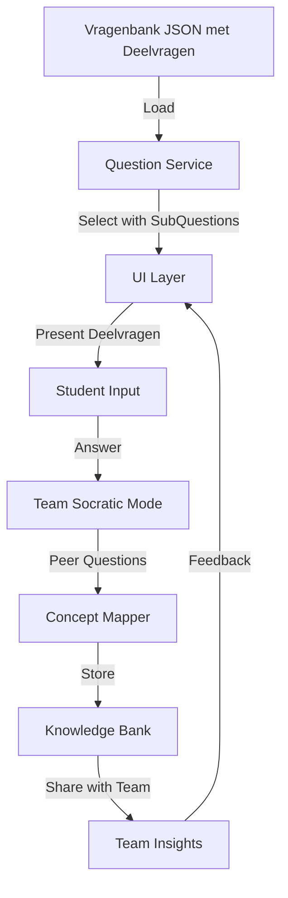

# Product Requirements Document (PRD)
## Economic Defense Builder - Q&A Oefentool voor RvB Training

## Executive Summary

De Economic Defense Builder is een interactieve oefentool waarmee studenten die de rol van Raad van Bestuur (RvB) aannemen, systematisch hun verdediging kunnen opbouwen voor boardroom presentaties. De tool gebruikt peer-to-peer learning gecombineerd met visuele concept mapping om diepgaand begrip van economische principes te ontwikkelen.

## Product Visie

### Probleem Statement

Studenten die zich voorbereiden op de boardroom assessment worstelen met:
- Het verbinden van theoretische economische concepten met praktijksituaties
- Het formuleren van onderbouwde, gestructureerde antwoorden onder druk
- Het anticiperen op kritische vervolgvragen van stakeholders
- Het ontwikkelen van diepgaand begrip versus oppervlakkige antwoorden

### Oplossing

Een intelligente oefenomgeving die:
- Complexe vragen systematisch opbreekt in behapbare componenten
- Economische concepten visueel verbindt met praktijkcontext
- Via peer-to-peer Socratische dialoog kritisch denken stimuleert
- Een persoonlijke kennisbank opbouwt van sterke argumenten
- Teamleden laat oefenen met elkaar als sparring partners

### Doelgroep

- **Primair**: HBO Bedrijfskunde jaar 2 studenten (RvB rol)
- **Secundair**: Studenten die zich willen voorbereiden op stakeholder vragen
- **Context**: Voorbereiding op De Strategische Arena assessment

## Core Features

### 1. Pre-decomposed Question System

#### Functionaliteit

Elke stakeholder vraag is vooraf gedecomposeerd in 3-5 deelvragen in de vragenbank JSON, waardoor studenten stap voor stap kunnen antwoorden zonder runtime processing.

#### User Flow

```
[Vraag Selecteren uit Vragenbank]
        ↓
[Laad Voorgedefinieerde Deelvragen]
        ↓
[Presenteer Deelvragen Sequentieel]
        ↓
[Student Beantwoordt Stap voor Stap]
        ↓
[Synthese tot Volledig Antwoord]
```

#### Data Structuur in Vragenbank

```json
{
  "vraag": "Hoofdvraag van stakeholder",
  "deelvragen": [
    {
      "id": "1a",
      "vraag": "Conceptuele deelvraag",
      "type": "concept",
      "hints": ["Hint 1", "Hint 2"],
      "verwachtAntwoord": "Richtlijn voor antwoord"
    },
    {
      "id": "1b",
      "vraag": "Context deelvraag",
      "type": "context",
      "hints": ["Bedrijfsspecifieke hints"],
      "verwachtAntwoord": "Kwantificeer met data"
    }
  ],
  "vervolgvragen": {
    "clarification": ["Templates voor verduidelijking"],
    "evidence": ["Templates voor bewijs vragen"]
  }
}
```

**Voordelen**:
- Geen runtime decompositie nodig
- Consistente kwaliteit voor alle studenten
- Handgemaakte pedagogisch verantwoorde deelvragen
- Direct beschikbaar zonder processing delay

### 2. Concept Web Builder

#### Functionaliteit
Interactieve visuele tool die economische concepten verbindt met bedrijfscontext en stakeholder belangen.

#### Componenten
- **Nodes**: Concepten, bedrijfselementen, stakeholders
- **Edges**: Relaties, effecten, afhankelijkheden
- **Layers**:
  - Theoretisch niveau (economische principes)
  - Praktisch niveau (bedrijfstoepassing)
  - Impact niveau (stakeholder effecten)

#### Visualisatie Specificaties
```javascript
{
  nodeTypes: [
    'economic_concept',
    'business_context',
    'stakeholder_impact',
    'supporting_data'
  ],
  edgeTypes: [
    'causes',
    'influences',
    'contradicts',
    'supports'
  ],
  interactivity: {
    zoom: true,
    drag: true,
    expand_collapse: true,
    highlight_path: true
  }
}
```

### 3. Team Socratic Mode

#### Functionaliteit

Peer-to-peer oefensysteem waar teamleden elkaar helpen met kritische vervolgvragen, ondersteund door gestructureerde vraagkaarten.

#### Oefenmodi

**Team Mode (Primair)**:
- Duo-oefening: één student als RvB, ander als "Critical Friend"
- Gestructureerde vraagkaarten voor de Critical Friend rol
- Rol-rotatie na elke vraag-antwoord cyclus
- Peer feedback en evaluatie

**Solo Mode (Backup)**:
- Systeem presenteert vraagkaart suggesties
- Student stelt zichzelf vervolgvragen
- Zelfreflectie op antwoord kwaliteit

#### Vraag Templates voor Critical Friend

```javascript
const questionTemplates = {
  clarification: [
    "Kun je dat concreter maken met een voorbeeld uit jullie bedrijf?",
    "Wat bedoel je precies met [concept X]?",
    "Hoe verschilt dit van [vergelijkbaar concept]?"
  ],
  evidence: [
    "Welke data ondersteunt deze bewering?",
    "Heb je benchmarks van de sector?",
    "Wat zeggen de cijfers uit het jaarverslag?"
  ],
  perspective: [
    "Hoe zou de AFM hier tegenaan kijken?",
    "Wat vindt jullie belangrijkste concurrent?",
    "En vanuit duurzaamheidsperspectief?"
  ],
  implications: [
    "Wat gebeurt er als de rente stijgt?",
    "Hoe beïnvloedt dit jullie supply chain?",
    "Welke risico's zie je over 5 jaar?"
  ],
  alternatives: [
    "Welke andere verklaring is mogelijk?",
    "Heb je scenario B overwogen?",
    "Wat als het tegenovergestelde waar is?"
  ]
}
```

#### Peer Evaluation Rubric

```markdown
Beoordeel je teamgenoot op:
□ Gebruikt economische concepten correct (0-5)
□ Onderbouwt met relevante data (0-5)
□ Maakt aannames expliciet (0-5)
□ Beantwoordt de kernvraag (0-5)
□ Toont kritisch denken (0-5)

Totaal: ___/25 punten

Sterkste punt: ________________
Verbeterpunt: _________________
```

#### Question Helper Cards

- **Digitale kaarten** met voorbeeldvragen per categorie
- **Shuffle functie** voor variatie in vragen
- **Moeilijkheidsgraad indicator** (basis/gevorderd/expert)
- **Contextual hints** gebaseerd op het onderwerp

### 4. Knowledge Bank System

#### Functionaliteit

Persoonlijke database van sterke antwoorden, argumenten en voorbeelden.

#### Features

- **Auto-tagging**: Economische concepten automatisch getagd
- **Quality Score**: Beoordeelt antwoord sterkte (incl. peer scores)
- **Reusability**: Suggesties bij vergelijkbare vragen
- **Growth Tracking**: Visualiseert kennisgroei over tijd
- **Team Insights**: Zie sterke antwoorden van teamgenoten

#### Data Structuur

```json
{
  "answer_id": "uuid",
  "question_context": {
    "stakeholder": "AFM",
    "theme": "conjunctuurgevoeligheid",
    "difficulty": "gevorderd"
  },
  "student_response": {
    "content": "...",
    "concepts_used": ["BBP", "multiplier", "elasticiteit"],
    "quality_score": 8.5,
    "feedback_received": "..."
  },
  "metadata": {
    "timestamp": "2025-01-10T10:00:00Z",
    "session_id": "...",
    "iterations": 3
  }
}
```

## User Experience Design

### Information Architecture

```
Home
├── Dashboard
│   ├── Progress Overview
│   ├── Upcoming Sessions
│   └── Recent Performance
├── Practice Mode
│   ├── Select Stakeholder
│   ├── Choose Difficulty
│   └── Start Session
├── Knowledge Bank
│   ├── My Best Answers
│   ├── Concept Map
│   └── Growth Analytics
└── Settings
    ├── Company Profile
    ├── Learning Preferences
    └── Notification Settings
```

### User Interface Principles

1. **Progressive Disclosure**: Start simpel, onthul complexiteit gradueel
2. **Visual Hierarchy**: Belangrijkste info prominent, details op aanvraag
3. **Consistent Feedback**: Directe, constructieve feedback op elke actie
4. **Mobile-First**: Volledig responsive, ook voor onderweg oefenen
5. **Accessibility**: WCAG 2.1 AA compliant

### Key Screens

#### Practice Session Screen
- **Header**: Timer, Progress bar, Stakeholder avatar
- **Main Area**: Current question/sub-question
- **Sidebar**: Concept hints, Previous answers
- **Bottom**: Input area, Submit/Next buttons

#### Concept Web Screen
- **Canvas**: Interactive node-edge diagram
- **Toolbar**: Zoom, Filter, Export options
- **Legend**: Node/edge type explanations
- **Inspector**: Details panel for selected elements

## Technical Architecture

### Frontend Stack
```javascript
{
  framework: "Vanilla JavaScript ES6+",
  styling: "Tailwind CSS (CDN)",
  visualization: "D3.js for concept maps",
  state: "LocalStorage + IndexedDB",
  offline: "Service Worker with cache-first strategy"
}
```

### Core Modules

```javascript
// Module structure
/js/components/
├── concept-mapper.js           // Visual concept web builder
├── team-socratic.js           // Team-based questioning system
├── question-cards.js           // Question template manager
├── peer-evaluator.js          // Peer feedback system
├── knowledge-bank.js           // Answer storage & retrieval
├── practice-session.js         // Session orchestration
└── analytics-tracker.js        // Progress monitoring

/js/services/
├── question-service.js        // Question selection & templates
├── team-service.js            // Team pairing & rotation
├── storage-service.js         // Data persistence
├── export-service.js          // PDF/JSON export
└── sync-service.js            // Optional team data sync
```

### Data Flow



### Integration Points

1. **Vragenbank Integration**

```javascript
class QuestionService {
  async loadQuestions() {
    const data = await fetch('/course-docs/toetsing/toetsing-vragenbank.json');
    return data.json(); // Deelvragen zijn al in de JSON
  }

  getSubQuestions(questionId) {
    // Direct ophalen, geen decompositie nodig
    return this.questions.find(q => q.id === questionId).deelvragen;
  }

  getFollowUpTemplates(questionId, category) {
    return this.questions.find(q => q.id === questionId).vervolgvragen[category];
  }
}
```

2. **Existing State Manager**

```javascript
import stateManager from '../core/state-manager.js';

class PracticeSession {
  saveProgress() {
    stateManager.set('practiceProgress', {
      questionsAnswered: this.answered,
      conceptsMastered: this.concepts,
      currentStreak: this.streak
    });
  }
}
```

3. **Team Socratic Implementation Example**

```javascript
class TeamSocraticMode {
  constructor() {
    this.questionTemplates = questionTemplates; // From config
    this.currentSession = null;
    this.peerHistory = [];
  }

  startTeamSession(studentA, studentB, stakeholderQuestion) {
    this.currentSession = {
      responder: studentA,
      questioner: studentB,
      mainQuestion: stakeholderQuestion,
      followUpQuestions: [],
      startTime: Date.now()
    };

    return this.decomposeQuestion(stakeholderQuestion);
  }

  getQuestionSuggestion(category, context) {
    const templates = this.questionTemplates[category];
    const contextual = templates.filter(q =>
      this.isRelevant(q, context)
    );

    return {
      template: this.shuffle(contextual)[0],
      hints: this.getContextualHints(context),
      difficulty: this.assessDifficulty(context)
    };
  }

  recordPeerExchange(question, answer, feedback) {
    this.currentSession.followUpQuestions.push({
      question,
      answer,
      feedback,
      timestamp: Date.now()
    });

    // Store for knowledge bank
    this.saveToBestPractices(question, answer, feedback);
  }

  switchRoles() {
    const temp = this.currentSession.responder;
    this.currentSession.responder = this.currentSession.questioner;
    this.currentSession.questioner = temp;

    // New main question for role switch
    return this.selectNewQuestion();
  }
}
```

## Success Metrics

### Engagement Metrics

- **Daily Active Users**: Target 70% van RvB studenten
- **Average Session Duration**: >15 minuten
- **Questions per Session**: >5 vragen
- **Return Rate**: >80% binnen 48 uur
- **Team Practice Sessions**: >3 per week
- **Peer Feedback Given**: >10 per student

### Learning Metrics

- **Concept Coverage**: 100% economische kernconcepten
- **Answer Quality Score**: Gemiddeld >7/10 na 5 sessies
- **Confidence Rating**: Stijging van 30% na 10 sessies
- **Assessment Performance**: +20% hogere scores vs controlegroep
- **Peer Question Quality**: Progressie in vraagdiepte
- **Team Collaboration Score**: Effectiviteit van peer learning

### Technical Metrics
- **Page Load Time**: <2 seconden
- **Interaction Latency**: <100ms
- **Offline Availability**: 100% core features
- **Cross-device Sync**: <5 seconden

## Implementation Phases

### Phase 1: MVP (Week 1-2)
- [ ] Load pre-decomposed questions from JSON
- [ ] Simple text-based concept linking
- [ ] Team-based Socratic questions
- [ ] Local storage only

### Phase 2: Enhanced (Week 3-4)
- [ ] Visual concept mapper
- [ ] Enhanced peer question templates
- [ ] Knowledge bank with tagging
- [ ] Basic analytics

### Phase 3: Complete (Week 5-6)
- [ ] Full adaptive questioning
- [ ] Advanced visualizations
- [ ] Peer comparison features
- [ ] Export capabilities

## Risk Mitigation

| Risk | Impact | Probability | Mitigation |
|------|---------|-------------|------------|
| Complex UI overwelmt studenten | High | Medium | Progressive disclosure, onboarding tutorial |
| AI genereert irrelevante vragen | Medium | Low | Fallback naar curated vragenset |
| Concept map wordt te complex | Medium | Medium | Filters, zoom levels, simplify option |
| Students gamen het systeem | Low | Medium | Variatie in vragen, quality checks |

## Acceptance Criteria

### Functional Requirements
- ✅ Kan alle 75+ vragen uit vragenbank laden
- ✅ Decomposed minimaal 3 deelvragen per hoofdvraag
- ✅ Genereert relevante Socratische vragen
- ✅ Slaat voortgang persistent op
- ✅ Werkt offline na eerste load

### Non-Functional Requirements
- ✅ Lighthouse score >90
- ✅ WCAG 2.1 AA compliant
- ✅ Werkt op mobile devices
- ✅ <2 sec initial load
- ✅ Zero runtime errors in production

## Dependencies

### Internal

- Enhanced vragenbank JSON (met deelvragen en vervolgvragen)
- State management system
- Tailwind CSS setup
- Service worker infrastructure

### External
- D3.js voor visualisaties (CDN)
- Optional: OpenAI API voor geavanceerde Socratische vragen
- Optional: Cloud storage API voor cross-device sync

## Open Questions

1. Moet de tool integreren met bestaande team features?
2. Is real-time collaboration gewenst (meerdere RvB leden samen)?
3. Welke analytische inzichten willen docenten zien?
4. Budget/resources voor AI integratie?

## Appendix

### Mockups
[Te ontwikkelen wireframes]

### User Stories
1. Als RvB student wil ik complexe vragen kunnen oefenen zodat ik voorbereid ben op het assessment
2. Als student wil ik zien welke concepten ik beheers zodat ik gericht kan studeren
3. Als student wil ik mijn beste antwoorden kunnen bewaren zodat ik ze kan hergebruiken

### Technical Specifications
[Gedetailleerde API documentatie volgt]

---

*Document Version: 1.2*
*Last Updated: Januari 2025*
*Status: Updated with Pre-decomposed Questions & Team Socratic Mode*
*Owner: Bedrijfskunde Curriculum Team*
