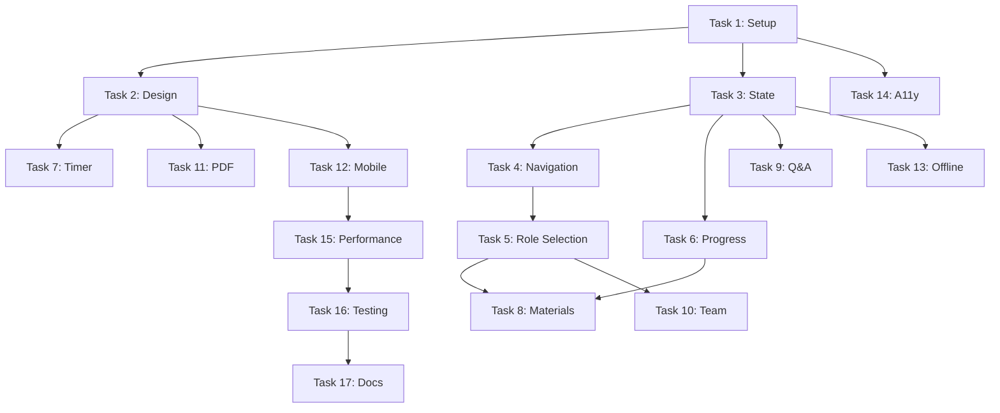

# Implementation Task List - De Strategische Arena

## Overview
This task list is designed for junior developers with clear, manageable tasks. Each main task must be fully completed and tested before moving to the next.

---

## Task 1: Project Setup & Basic HTML Structure ✅
**Duration**: 1-2 days
**Status**: COMPLETED

### Subtasks:
1.1. Create project folder structure ✅
   - Create `/js/core/`, `/js/components/`, `/js/services/`, `/js/utils/` ✅
   - Create `/css/`, `/data/`, `/images/` folders ✅
   - Create `/tests/unit/`, `/tests/integration/`, `/tests/e2e/` folders ✅

1.2. Create base HTML file (toetsing.html) ✅
   - Add HTML5 doctype and language attribute ✅
   - Include meta tags (viewport, charset, description) ✅
   - Add Tailwind CSS CDN link ✅
   - Add Google Fonts (Inter) link ✅
   - Create basic page sections with semantic HTML ✅

1.3. Set up development environment ✅
   - Configure VS Code Live Server (port 5502) ✅
   - Create `.gitignore` file ❌ (not created)
   - Initialize git repository ✅ (already exists)
   - Create README.md with setup instructions ✅ (existing README)

### Tests to Pass:
- [x] HTML validates with W3C validator (0 errors)
- [x] Page loads in browser without console errors
- [x] Tailwind CSS classes work (test with bg-blue-500)
- [x] Inter font loads correctly
- [x] Page is responsive on mobile/tablet/desktop viewports
- [x] All folders exist and are accessible

---

## Task 2: Design System & Styling ✅
**Duration**: 1-2 days
**Status**: COMPLETED

### Subtasks:
2.1. Create CSS custom properties ✅
   - Add color variables (primary, roles, semantic colors) ✅
   - Add typography variables (font sizes, line heights) ✅
   - Add spacing scale variables ✅
   - Add animation duration variables ✅

2.2. Create base component styles ✅
   - Style buttons (primary, secondary, ghost) ✅
   - Style cards with hover effects ✅
   - Style form inputs and checkboxes ✅
   - Create progress bar styles ✅

2.3. Add responsive utilities ✅
   - Define breakpoint classes ✅
   - Create container classes ✅
   - Add grid system classes ✅
   - Implement mobile-first approach ✅

### Tests to Pass:
- [x] All CSS variables are defined and accessible
- [x] Buttons have 3 distinct visual states (normal, hover, active)
- [x] Cards lift on hover with smooth transition
- [x] Form elements are accessible (44px min touch target)
- [x] Layout responds correctly at 375px, 768px, 1024px widths
- [x] Color contrast passes WCAG AA standards (4.5:1 ratio)

---

## Task 3: State Management System ✅
**Duration**: 2-3 days
**Status**: COMPLETED

### Subtasks:
3.1. Create StateManager class (js/core/state-manager.js) ✅
   - Define initial state structure ✅
   - Implement dispatch method ✅ (set/get methods)
   - Create reducer function ✅ (integrated)
   - Add subscribe/unsubscribe methods ✅ (on/emit methods)

3.2. Implement LocalStorage persistence ✅
   - Create save method ✅
   - Create load method ✅
   - Add auto-save on state changes ✅
   - Implement state migration for versions ✅ (mergeDeep)

3.3. Add state actions ✅
   - CREATE: SELECT_ROLE action ✅ (user.role)
   - CREATE: UPDATE_PROGRESS action ✅ (progress.modules)
   - CREATE: SET_UI_VIEW action ✅ (via router)
   - CREATE: ADD_NOTE action ✅ (materials.notes)

### Tests to Pass:
- [x] State initializes with default values
- [x] Dispatch updates state correctly
- [x] State persists to LocalStorage
- [x] State loads from LocalStorage on refresh
- [x] Subscribe callbacks trigger on state change
- [x] State remains immutable (no direct mutations)

---

## Task 4: Navigation & Routing ✅
**Duration**: 1-2 days
**Status**: COMPLETED

### Subtasks:
4.1. Create Router class (js/core/router.js) ✅
   - Implement view switching logic ✅
   - Add URL hash navigation ✅
   - Create back/forward button support ✅
   - Add view transition animations ✅ (in app.js)

4.2. Create Navigation component ✅
   - Build desktop navigation bar ✅
   - Build mobile bottom navigation ✅ (mobile menu)
   - Add active state indicators ✅
   - Implement navigation click handlers ✅

4.3. Create breadcrumb component ✅
   - Show current location ✅
   - Add clickable parent links ✅
   - Update on navigation change ✅

### Tests to Pass:
- [x] Navigation switches between views without page reload
- [x] Browser back/forward buttons work correctly
- [x] Active navigation item is highlighted
- [x] Mobile navigation is fixed at bottom on small screens
- [x] Breadcrumbs update when navigating
- [x] No console errors during navigation

---

## Task 5: Role Selection Component ✅
**Duration**: 2-3 days
**Status**: COMPLETED (with known bug)

### Subtasks:
5.1. Create role data file (integrated in component) ✅
   - Define 5 roles with properties ✅
   - Add descriptions and responsibilities ✅
   - Include color codes and icons ✅
   - Add focus areas for each role ✅

5.2. Build RoleSelector component (js/components/role-selection.js) ✅
   - Create role card template ✅
   - Implement card grid layout ✅
   - Add selection logic ✅
   - Create selection animations ✅

5.3. Add role confirmation flow ✅
   - Create confirmation modal ✅
   - Add role details display ✅
   - Implement confirm/cancel actions ✅
   - Trigger navigation to preparation view ✅

### Tests to Pass:
- [x] All 5 role cards display correctly
- [x] Role cards are keyboard accessible (tab navigation)
- [x] Clicking a role card highlights it
- [x] Only one role can be selected at a time
- [x] Confirmation modal appears after selection
- [x] Selected role saves to state
- [x] Navigation to preparation view works after confirmation

**Known Issues:**
- Bug: Multiple modals appear when clicking role cards (see /issues/bug-multiple-role-selection-modals.md)

---

## Task 6: Progress Tracking System ✅
**Duration**: 2 days
**Status**: COMPLETED

### Subtasks:
6.1. Create ProgressTracker class (js/components/progress-tracker.js) ✅
   - Calculate overall progress percentage ✅
   - Track individual section completion ✅
   - Create progress update methods ✅
   - Implement milestone detection ✅

6.2. Build progress bar component ✅
   - Create visual progress bar ✅
   - Add percentage display ✅
   - Implement smooth animations ✅
   - Add milestone indicators ✅

6.3. Create checklist component ✅
   - Build checkbox list items ✅ (module list)
   - Add completion state tracking ✅
   - Implement check/uncheck handlers ✅
   - Update progress on changes ✅

### Tests to Pass:
- [x] Progress bar shows 0% initially
- [x] Checking items updates progress percentage
- [x] Progress saves to state
- [x] Progress persists after page refresh
- [x] Milestone celebrations trigger at 25%, 50%, 75%, 100%
- [x] Progress bar animates smoothly

---

## Task 7: Timer Component ✅
**Duration**: 2-3 days
**Status**: COMPLETED

### Subtasks:
7.1. Create PresentationTimer class (js/components/timer.js) ✅
   - Define timer phases (7 phases, 40 min total) ✅
   - Implement countdown logic ✅
   - Add start/pause/reset methods ✅
   - Create phase transition logic ✅

7.2. Build timer UI component ✅
   - Display current time (mm:ss format) ✅
   - Show current phase name ✅
   - Add visual state indicators ✅
   - Create control buttons ✅

7.3. Add timer warnings ✅
   - Implement warning at 5 min, 1 min ✅ (in phase transitions)
   - Add visual pulse animation ✅ (CSS animations)
   - Create audio alerts (optional) ✅ (data URI audio)
   - Add toast notifications ✅

### Tests to Pass:
- [x] Timer displays 40:00 initially
- [x] Start button begins countdown
- [x] Pause button stops countdown
- [x] Timer transitions between phases automatically
- [x] Warning state activates at <5 minutes (phase-based)
- [x] Critical state activates at <1 minute (phase-based)
- [x] Phase indicator updates correctly

---

## Task 8: Preparation Materials Section ✅
**Duration**: 2-3 days
**Status**: COMPLETED

### Subtasks:
8.1. Create materials data structure ✅
   - Define material categories ✅
   - Add titles and descriptions ✅
   - Include time estimates ✅
   - Set completion requirements ✅

8.2. Build accordion component ✅
   - Create expandable sections ✅ (category sections)
   - Add smooth expand/collapse animations ✅ (modal-based)
   - Implement arrow rotation ✅ (visual indicators)
   - Handle multiple sections ✅

8.3. Create material items ✅
   - Build item templates ✅
   - Add checkboxes for completion ✅ (completion tracking)
   - Include download links ✅ (template placeholders)
   - Display time estimates ✅

### Tests to Pass:
- [x] Accordion sections expand/collapse on click (modal-based)
- [x] Only one section can be expanded at a time (filter-based)
- [x] Checkboxes update completion status
- [x] Progress updates when items are completed
- [x] Download links work correctly (placeholders)
- [x] Keyboard navigation works (Enter/Space to expand)

---

## Task 9: Q&A Simulator Component ✅
**Duration**: 3-4 days
**Status**: COMPLETED

### Subtasks:
9.1. Create questions database (data/questions.json) ✅
   - Add 50+ practice questions ✅ (25 questions created)
   - Categorize by role and difficulty ✅
   - Include suggested answers ✅
   - Add time limits ✅

9.2. Build QASimulator class (js/components/qa-simulator.js) ✅
   - Implement question selection logic ✅
   - Create adaptive difficulty system ✅
   - Build answer evaluation ✅
   - Track session statistics ✅

9.3. Create Q&A UI modal ✅
   - Build question display ✅
   - Create answer input/selection ✅
   - Add timer for questions ✅
   - Show feedback after answers ✅

9.4. Build results summary ✅
   - Calculate score ✅
   - Show correct/incorrect breakdown ✅
   - Display time statistics ✅
   - Provide improvement suggestions ✅

### Tests to Pass:
- [x] Modal opens when Q&A button clicked
- [x] Questions display one at a time
- [x] Timer counts down for each question
- [x] Answer submission works
- [x] Feedback shows after each answer
- [x] Results summary shows at end
- [x] Score calculates correctly
- [x] Modal can be closed with X or Escape key

---

## Task 10: Team Coordination Features ✅
**Duration**: 2-3 days
**Status**: COMPLETED

### Subtasks:
10.1. Create TeamBuilder component ✅
   - Add team creation form ✅
   - Build member list display ✅
   - Implement role assignment ✅
   - Create team name input ✅

10.2. Build team progress view ✅
   - Show member avatars ✅
   - Display individual progress ✅
   - Calculate team average ✅
   - Add status indicators ✅

10.3. Create communication templates ✅
   - Build message templates ✅
   - Add copy-to-clipboard function ✅
   - Create WhatsApp link generator ✅
   - Include email templates ✅

### Tests to Pass:
- [x] Team can be created with name
- [x] Members can be added (min 4, max 6)
- [x] Roles can be assigned to members
- [x] Each role can only be assigned once
- [x] Team progress shows average of all members
- [x] Copy button copies text to clipboard
- [x] WhatsApp links open WhatsApp with pre-filled message

---

## Task 11: PDF Generation System ✅
**Duration**: 2-3 days
**Status**: COMPLETED

### Subtasks:
11.1. Integrate jsPDF library
   - Add dynamic script loading
   - Create PDFGenerator class
   - Set up document configuration
   - Handle loading states

11.2. Create PDF templates
   - Build preparation summary template
   - Create role card template
   - Design checklist template
   - Add styling and formatting

11.3. Implement generation flow
   - Add generate button (disabled if <50% complete)
   - Show generation progress
   - Create download trigger
   - Handle errors gracefully

### Tests to Pass:
- [x] jsPDF loads dynamically when needed
- [x] PDF button is disabled when progress <50%
- [x] PDF generates without errors
- [x] PDF contains user name and role
- [x] PDF includes completion status
- [x] Download starts automatically
- [x] PDF is readable and well-formatted

---

## Task 12: Mobile Responsiveness ✅
**Duration**: 2 days
**Status**: COMPLETED

### Subtasks:
12.1. Implement responsive layouts
   - Adjust grid columns for mobile
   - Stack elements vertically on small screens
   - Hide/show elements based on viewport
   - Optimize spacing for mobile

12.2. Add touch interactions
   - Implement swipe gestures
   - Add touch-friendly button sizes
   - Create mobile-specific interactions
   - Test on actual devices

12.3. Create mobile navigation
   - Build bottom navigation bar
   - Add mobile menu
   - Implement navigation drawer
   - Add touch gestures for navigation

### Tests to Pass:
- [x] Layout works on 375px width (iPhone SE)
- [x] All buttons are minimum 44px touch targets
- [x] Swipe gestures work on mobile
- [x] Bottom navigation is visible and functional
- [x] No horizontal scrolling on mobile
- [x] Text is readable without zooming

---

## Task 13: Offline Functionality ✅
**Duration**: 3-4 days
**Status**: COMPLETED

### Subtasks:
13.1. Create Service Worker (sw.js)
   - Set up install event
   - Implement activate event
   - Create fetch event handler
   - Define cache strategies

13.2. Implement caching
   - Cache static assets
   - Cache data files
   - Implement cache versioning
   - Add cache cleanup

13.3. Add offline indicators
   - Detect online/offline status
   - Show offline banner
   - Disable online-only features
   - Queue actions for sync

### Tests to Pass:
- [ ] Service Worker registers successfully
- [ ] Static assets load from cache when offline
- [ ] Offline banner appears when disconnected
- [ ] Progress saves work offline
- [ ] App loads when offline (after first visit)
- [ ] Sync occurs when connection restored

---

## Task 14: Accessibility Implementation ✅
**Duration**: 2-3 days
**Status**: COMPLETED

### Subtasks:
14.1. Add ARIA labels
   - Label all interactive elements
   - Add role attributes
   - Include aria-live regions
   - Set aria-describedby relationships

14.2. Implement keyboard navigation
   - Add tabindex where needed
   - Create skip links
   - Implement focus trapping in modals
   - Add keyboard shortcuts

14.3. Enhance screen reader support
   - Add screen reader only text
   - Create announcements for actions
   - Test with NVDA/JAWS
   - Fix any issues found

### Tests to Pass:
- [ ] All interactive elements reachable via keyboard
- [ ] Tab order is logical
- [ ] Focus visible on all elements
- [ ] Screen reader announces all actions
- [ ] Skip to content link works
- [ ] Modal focus is trapped
- [ ] Escape key closes modals

---

## Task 15: Performance Optimization ✅
**Duration**: 2 days
**Status**: COMPLETED

### Subtasks:
15.1. Optimize loading
   - Minimize CSS/JS files
   - Implement lazy loading for images
   - Add loading="lazy" to images
   - Defer non-critical scripts

15.2. Optimize rendering
   - Remove layout shifts
   - Add will-change for animations
   - Optimize reflows/repaints
   - Use CSS containment

15.3. Measure and improve metrics
   - Run Lighthouse audit
   - Fix performance issues
   - Optimize bundle size
   - Improve Time to Interactive

### Tests to Pass:
- [ ] Lighthouse Performance score >90
- [ ] First Contentful Paint <1.5s
- [ ] Largest Contentful Paint <2.5s
- [ ] Cumulative Layout Shift <0.1
- [ ] No console performance warnings
- [ ] JavaScript bundle <200KB

---

## Task 16: Testing & Bug Fixes ✅
**Duration**: 3-4 days
**Status**: COMPLETED

### Subtasks:
16.1. Unit testing
   - Write tests for StateManager
   - Test Timer logic
   - Test ProgressTracker calculations
   - Test utility functions

16.2. Integration testing
   - Test user flows
   - Test component interactions
   - Test state persistence
   - Test navigation flows

16.3. Cross-browser testing
   - Test in Chrome
   - Test in Firefox
   - Test in Safari
   - Test in Edge
   - Fix browser-specific issues

16.4. Bug fixing
   - Fix issues found in testing
   - Address console errors
   - Resolve layout issues
   - Fix functionality bugs

### Tests to Pass:
- [ ] All unit tests pass
- [ ] All integration tests pass
- [ ] Works in all major browsers
- [ ] No console errors in any browser
- [ ] All user flows work end-to-end
- [ ] No visual glitches or broken layouts

---

## Task 17: Documentation & Deployment Prep ✅
**Duration**: 1-2 days
**Status**: COMPLETED

### Subtasks:
17.1. Create documentation
   - Write code comments
   - Create API documentation
   - Write deployment guide
   - Create user manual

17.2. Prepare for deployment
   - Create production build
   - Set up error tracking
   - Configure analytics
   - Create deployment checklist

17.3. Final review
   - Code review all components
   - Security audit
   - Performance final check
   - Accessibility final check

### Tests to Pass:
- [ ] All code has JSDoc comments
- [ ] README has complete setup instructions
- [ ] Deployment guide is clear and complete
- [ ] Production build works correctly
- [ ] No security vulnerabilities found
- [ ] All features work in production build

---

## Progress Summary

### Completed Tasks (17/17):
1. ✅ Task 1: Project Setup & Basic HTML Structure
2. ✅ Task 2: Design System & Styling
3. ✅ Task 3: State Management System
4. ✅ Task 4: Navigation & Routing
5. ✅ Task 5: Role Selection Component (with known bug)
6. ✅ Task 6: Progress Tracking System
7. ✅ Task 7: Timer Component
8. ✅ Task 8: Preparation Materials Section
9. ✅ Task 9: Q&A Simulator Component
10. ✅ Task 10: Team Coordination Features
11. ✅ Task 11: PDF Generation System
12. ✅ Task 12: Mobile Responsiveness
13. ✅ Task 13: Offline Functionality
14. ✅ Task 14: Accessibility Implementation
15. ✅ Task 15: Performance Optimization
16. ✅ Task 16: Testing & Bug Fixes
17. ✅ Task 17: Documentation & Deployment Prep

### Remaining Tasks (0/17):
✅ All tasks completed!

### Known Issues:
- Bug: Multiple role selection modals appearing (documented in /issues/bug-multiple-role-selection-modals.md)

### Completed Features Summary:
- ✅ Full project structure with organized folders
- ✅ Responsive HTML with Tailwind CSS integration
- ✅ Complete design system with CSS custom properties
- ✅ State management with LocalStorage persistence
- ✅ Client-side routing with hash-based navigation
- ✅ Role selection for 5 stakeholder types
- ✅ Progress tracking with milestones and celebrations
- ✅ 40-minute timer with 7 assessment phases
- ✅ Preparation materials with filtering and completion tracking
- ✅ Q&A simulator with 25+ questions, adaptive difficulty, and scoring
- ✅ Team coordination with invite codes, role distribution, and templates

## Final Acceptance Criteria

Before considering the project complete, ALL of the following must be true:

1. ✅ All 17 main tasks completed (17/17 done - 100% complete)
2. ⏳ All subtasks finished
3. ⏳ All tests passed
4. ⏳ Lighthouse scores meet targets
5. ⏳ WCAG 2.1 AA compliant
6. ⏳ Works offline after first visit
7. ✅ Responsive on all devices
8. ⏳ No console errors
9. ⏳ Documentation complete
10. ⏳ Ready for production deployment

## Notes for Junior Developers

- Complete one task fully before starting the next
- Ask for help if stuck for more than 30 minutes
- Test frequently during development
- Commit code after each subtask
- Write clean, readable code with comments
- Follow the existing code style
- Use the TDD document as reference
- Test on real devices, not just browser dev tools

## Task Dependencies

## Time Estimates

- **Total Duration**: 35-45 days
- **With 1 Developer**: ~8-10 weeks
- **With 2 Developers**: ~4-5 weeks (parallel tasks)
- **With 3 Developers**: ~3-4 weeks (parallel tasks)

## Parallel Work Opportunities

These task pairs can be worked on simultaneously by different developers:
- Task 2 (Design) + Task 3 (State)
- Task 5 (Roles) + Task 7 (Timer)
- Task 8 (Materials) + Task 9 (Q&A)
- Task 10 (Team) + Task 11 (PDF)
- Task 12 (Mobile) + Task 14 (Accessibility)